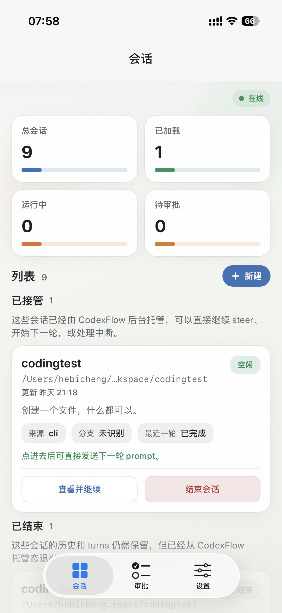
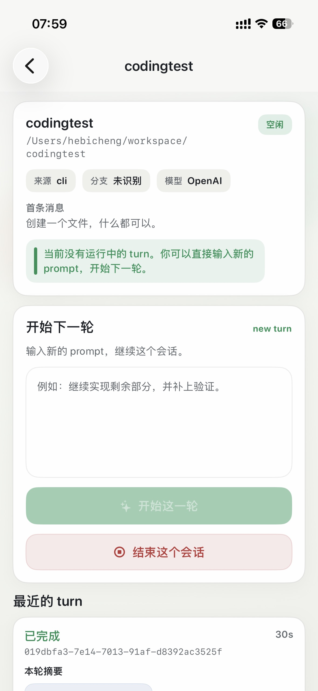
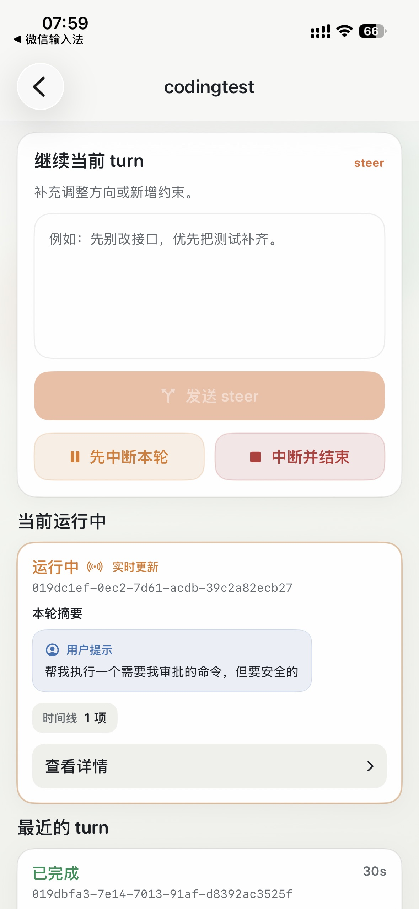
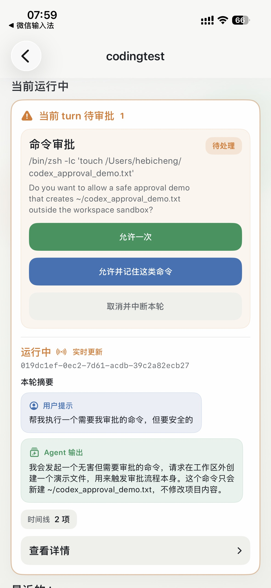
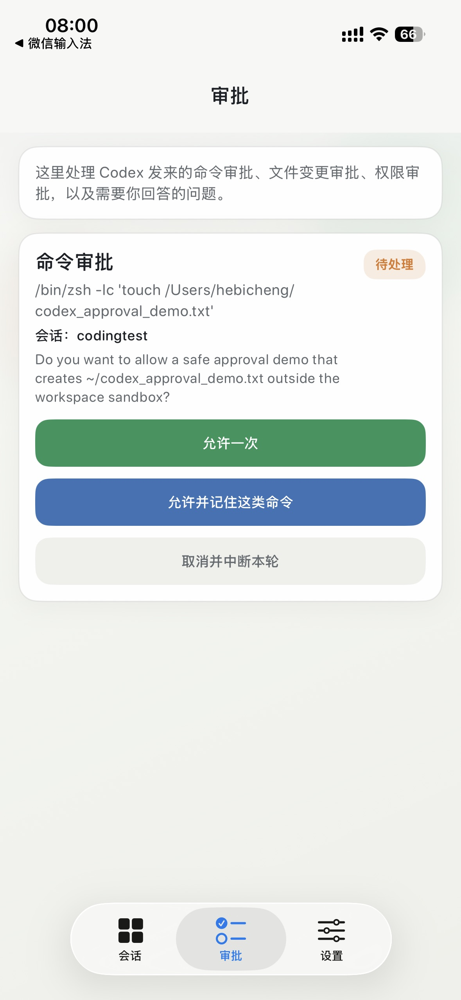
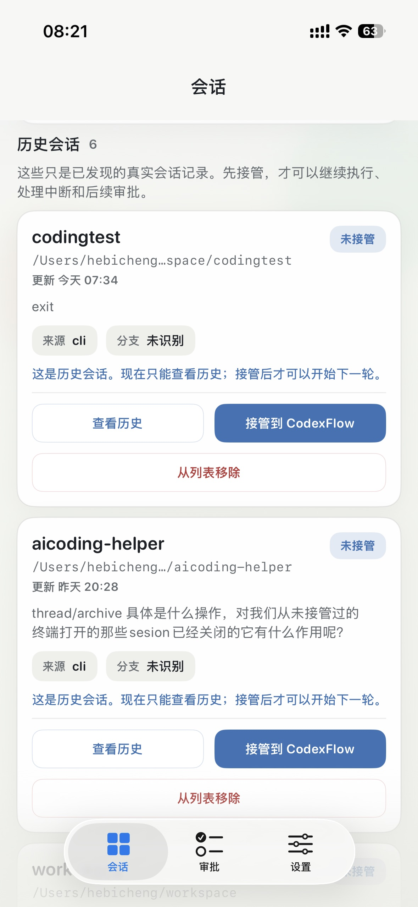
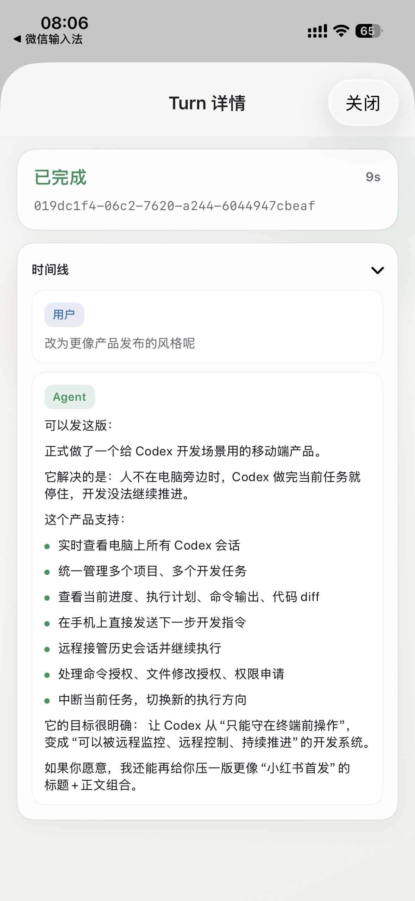
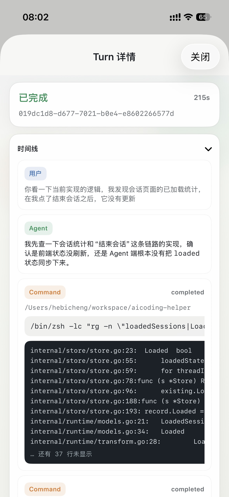
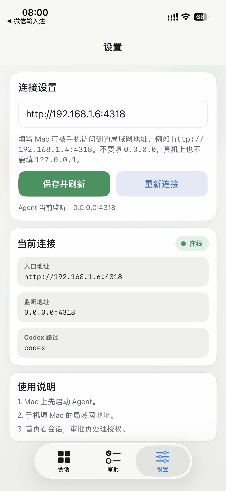

# CodexFlow

CodexFlow 是一个面向 Codex CLI 的跨端控制台。

它的目标不是“远程看终端”，而是把 Codex 的会话、turn、diff、审批、状态流，整理成一套适合手机和桌面客户端管理的控制平面。

当前仓库包含四部分：

- `Mac Agent`：运行在电脑上的本地服务，负责接入 Codex CLI
- `iOS App`：运行在 iPhone 上的 SwiftUI 客户端，负责监控、审批和继续指挥
- `Android App`：运行在 Android 设备或模拟器上的 Jetpack Compose 客户端
- `Windows App`：运行在 Windows 10/11 上的 WinUI 3 桌面客户端

## 工作原理

CodexFlow 不依赖 OCR，也不是去截图识别终端。

它直接接在 `codex app-server` 之上，通过结构化协议拿到真实的会话和执行状态，再转成适合各客户端消费的 HTTP API 与 SSE 事件流。

整体链路如下：

```text
Codex CLI / codex app-server
        │
        │ JSON-RPC over stdio
        ▼
Mac Agent
  - 启动并持有本地 codex app-server
  - 发现已有 session / loaded session
  - 接收通知、diff、plan、审批请求
  - 暴露 HTTP API + SSE
        │
        │ HTTP / SSE
        ▼
Client Apps
  - iOS / Android / Windows
  - 会话总览
  - 会话详情
  - 审批中心
  - 继续下一步 / steer / interrupt
```

这套设计的核心点是：

- `Mac Agent` 负责把 Codex 的原始协议适配成稳定的应用层接口
- iOS、Android、Windows 客户端都不直接操纵终端，而是操纵会话本身
- “自动发现已有会话”和“受控管理新会话”可以同时存在

## 当前已实现的功能

### Mac Agent

- 直接启动并连接本机 `codex app-server`
- 自动发现真实的 Codex 历史会话
- 读取 `thread/list`、`thread/read`、`thread/loaded/list`
- 支持新建受控会话
- 支持重新接管历史会话
- 支持开始新 turn、steer 当前 turn、interrupt 当前 turn
- 支持结束会话、归档会话
- 捕获命令审批、文件变更审批、权限审批、结构化用户输入请求
- 对外提供 HTTP API 和 SSE 事件流

### iOS App

- 会话总览页
- 已接管 / 已结束 / 历史会话分组
- 总会话、已加载、运行中、待审批统计
- 会话详情页
- plan / diff / timeline 展示
- 继续下一步、steer、interrupt
- 审批中心
- Agent 地址配置
- 只显示真实数据，不再回退 mock 数据

### Android App

- Dashboard、会话详情、审批中心、Settings
- 新建受控会话、resume、end、archive
- startTurn / steer / interrupt
- command、fileChange、permissions、userInput 审批处理
- DataStore 保存 Agent base URL
- SSE 实时刷新，断线后指数退避重连

### Windows App

- WinUI 3 三栏桌面控制台，窄屏自动折叠
- Dashboard、会话详情、审批中心、Settings
- 新建受控会话、resume、end、archive
- startTurn / steer / interrupt
- command、fileChange、permissions、userInput 审批处理
- 本地配置保存到 `%APPDATA%/CodexFlow/settings.json`
- SSE 实时刷新，断线后指数退避重连

## 当前状态

项目已经能跑通真实链路：

- Agent 可以连上本机 Codex CLI
- `dashboard` API 能返回真实会话数据
- iOS、Android、Windows 客户端共用同一套 API 契约消费真实数据并进行操作

当前还没有做的部分：

- 远程 relay
- 登录与设备配对
- APNs / FCM / Windows 推送
- macOS 菜单栏 Launcher
- 自动审批策略引擎
- iOS SSE 原生事件流接入

## 快速开始

### 1. 环境要求

- macOS
- 已安装并可用的 `codex` CLI
- 已完成 Codex 登录
- Go 1.26+
- Xcode（用于运行 iOS App）
- Android Studio / Android SDK（用于运行 Android App）
- Windows 10 19041+ / Windows 11、Visual Studio 2022、.NET SDK 8+、Windows App SDK（用于运行 Windows App）

### 2. 启动 Mac Agent

在仓库根目录执行：

```bash
go run ./cmd/codexflow-agent
```

默认监听地址：

```text
127.0.0.1:4318
```

可选环境变量：

- `CODEXFLOW_LISTEN_ADDR`
- `CODEXFLOW_CODEX_PATH`
- `CODEXFLOW_REFRESH_INTERVAL`
- `CODEXFLOW_STATE_DB_PATH`

### 3. 验证 Agent 是否正常

```bash
curl http://127.0.0.1:4318/healthz
curl http://127.0.0.1:4318/api/v1/dashboard
```

如果正常，你会拿到健康检查结果和真实会话列表。

### 4. 运行客户端

#### iOS App

用 Xcode 打开：

```text
ios/CodexFlow/CodexFlow.xcodeproj
```

然后运行 `CodexFlow` target。

#### Android App

用 Android Studio 打开：

```text
android/CodexFlowAndroid
```

Android 模拟器访问 Mac 本机 Agent 时，base URL 使用：

```text
http://10.0.2.2:4318
```

#### Windows App

用 Visual Studio 打开：

```text
windows/CodexFlowWindows/CodexFlowWindows.sln
```

启动项目选择 `CodexFlowWindows`。

### 5. 在 App 里配置 Agent 地址

如果是同一台 Mac 上跑模拟器：

```text
iOS Simulator / Windows 本机：      http://127.0.0.1:4318
Android Emulator 访问 Mac 本机：   http://10.0.2.2:4318
```

如果是真机或跨机器联调，建议让 Agent 监听局域网：

```bash
CODEXFLOW_LISTEN_ADDR=0.0.0.0:4318 go run ./cmd/codexflow-agent
```

然后在 App 的 `Settings` 页面填入 Mac 的局域网 IP，例如：

```text
http://192.168.1.10:4318
```

## 基本使用方式

1. 打开 `会话` 页面，查看当前真实会话。
2. 对历史会话点击“接管到 CodexFlow”，将其转为受控会话。
3. 在受控会话详情页查看 plan、diff、timeline。
4. 在受控会话详情页发送下一轮 prompt，或 steer 当前执行中的 turn。
5. 对正在执行的 turn，可以直接 interrupt。
6. 打开 `Approvals` 页面，处理等待中的审批请求。
7. 对不再需要的会话，可以结束或归档。

## API 概览

- `GET /healthz`
- `GET /api/v1/dashboard`
- `GET /api/v1/sessions`
- `POST /api/v1/sessions`
- `GET /api/v1/sessions/:id`
- `POST /api/v1/sessions/:id/resume`
- `POST /api/v1/sessions/:id/end`
- `POST /api/v1/sessions/:id/archive`
- `POST /api/v1/sessions/:id/turns/start`
- `POST /api/v1/sessions/:id/turns/steer`
- `POST /api/v1/sessions/:id/turns/interrupt`
- `GET /api/v1/approvals`
- `POST /api/v1/approvals/:id/resolve`
- `GET /api/v1/events`

## 仓库结构

```text
cmd/codexflow-agent        Go 启动入口
internal/codex            Codex app-server 协议适配
internal/runtime          会话管理、统计、审批编排
internal/httpapi          HTTP API 与 SSE
internal/store            本地状态存储
ios/CodexFlow             iOS SwiftUI 客户端
android/CodexFlowAndroid  Android Jetpack Compose 客户端
windows/CodexFlowWindows  Windows WinUI 3 客户端
docs                      架构与路线文档
assets                    README 截图资源
```

## 截图

<table>
  <tr>
    <td></td>
    <td></td>
  </tr>
  <tr>
    <td></td>
    <td></td>
  </tr>
  <tr>
    <td></td>
    <td></td>
  </tr>
  <tr>
    <td></td>
    <td></td>
  </tr>
  <tr>
    <td></td>
    <td></td>
  </tr>
</table>

## 说明

这个项目现在更接近一个可运行的产品初版，而不是最终版。

下一阶段计划：

- iOS 原生 SSE 接入
- macOS Launcher
- 局域网外的安全 relay
- 推送通知
- 自动审批策略
